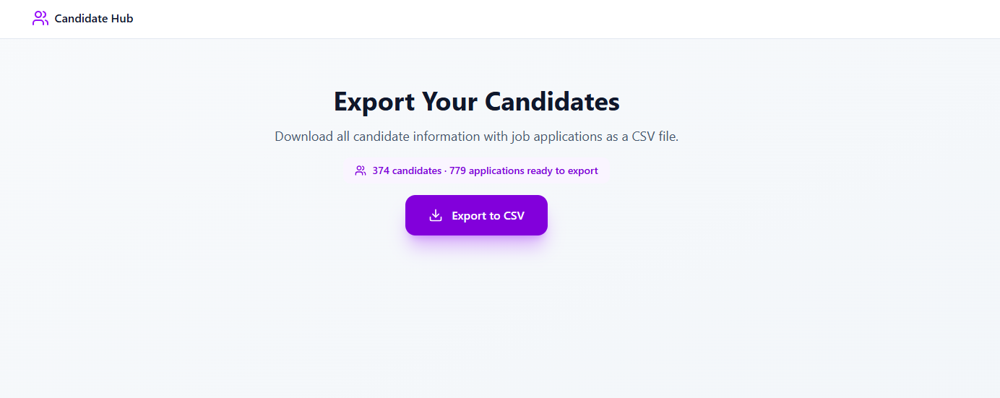
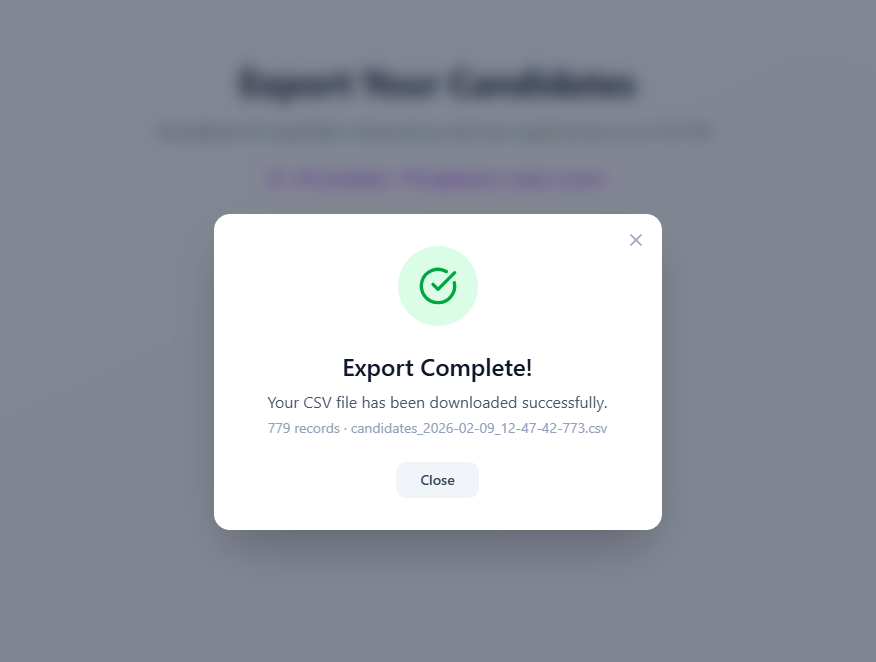
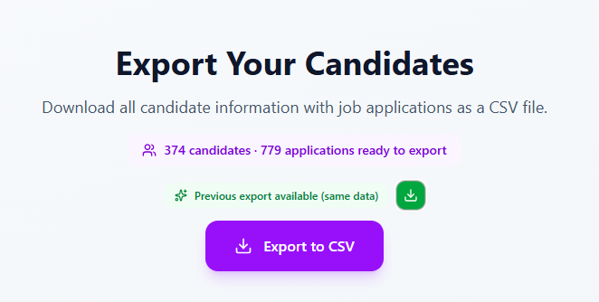

# Teamtailor Candidate Export

Full-stack application that connects to the [Teamtailor API](https://docs.teamtailor.com/), fetches all candidates with their job applications, and allows downloading the data as a CSV file.

## Screenshots

### Main Interface


### Export Progress


### Smart Cache - Download Previous Export


## Features

- Export all candidates + job applications to CSV
- **Smart caching** - reuse previous export if data hasn't changed (24h cache)
- Background job with real-time progress tracking
- Animated modal UI (progress bar, success/error states)
- Rate limiting and retry with exponential backoff
- **Parallel page fetching** with throttling (5 req/s max using `p-limit@3`)
- Streaming CSV generation (memory-efficient for large datasets)
- Professional logging system with structured JSON logs

## Tech Stack

| Layer | Technology |
|-------|-----------|
| Frontend | React 19, TypeScript, Vite, Tailwind CSS v4 |
| Backend | Node.js, Express 5, TypeScript, ts-node |
| Animation | motion/react |
| CSV | csv-stringify |
| Throttling | p-limit@3 (for parallel API requests) |
| Caching | localStorage (client-side, 24h TTL) |
| Logging | Custom structured logger with timestamps |
| Testing | Jest 29 + ts-jest + supertest |

## Project Structure

```
teamtailor/
├── client/                        # React frontend (Vite)
│   └── src/
│       ├── modules/
│       │   └── candidate-export/  # Export feature module
│       │       ├── components/    # ExportButton, ExportModal, ExportProgress
│       │       ├── hooks/         # useExportJob, useExportPolling
│       │       ├── utils/         # export-cache.util (localStorage cache)
│       │       └── types/         # export.types.ts
│       └── shared/
│           ├── components/ui/     # Button, Progress
│           └── utils/             # cn() helper
│
└── server/                        # Express backend
    └── src/
        ├── modules/
        │   └── candidate-export/  # Export feature module
        │       ├── controllers/   # REST endpoints
        │       ├── services/      # teamtailor, csv-generator, export-job, progress-tracker
        │       ├── models/        # ExportJob in-memory store
        │       ├── types/         # JSON API types
        │       ├── utils/         # api-client, retry
        │       └── __tests__/     # Jest unit tests
        └── shared/
            ├── config/            # env.config.ts (validation)
            ├── middleware/        # error-handler
            └── utils/             # retry.util, logger.util
```

## API Endpoints

| Method | Path | Description |
|--------|------|-------------|
| `GET` | `/api/candidate-export/count` | Get total candidates and applications count |
| `POST` | `/api/candidate-export/start` | Start export job → returns `{ jobId, status }` |
| `GET` | `/api/candidate-export/status/:jobId` | Poll job progress |
| `GET` | `/api/candidate-export/download/:jobId` | Download CSV file |
| `GET` | `/health` | Health check |

## Getting Started

### Prerequisites

- Node.js 18+ (20 LTS recommended)
- Teamtailor API key with Admin scope

### 1. Clone and install dependencies

```bash
git clone <repo-url>
cd teamtailor

# Install client dependencies
cd client && npm install

# Install server dependencies
cd ../server && npm install
```

### 2. Configure environment

```bash
cp .env.example .env
```

Edit `.env` and set your API key:

```bash
TEAMTAILOR_API_KEY=your_api_key_here
TEAMTAILOR_API_URL=https://api.teamtailor.com/v1  # or https://api.na.teamtailor.com/v1 for NA
TEAMTAILOR_API_VERSION=20240404
```

### 3. Run in development

**Option A — VS Code (recommended):**

Press `F5` to launch the Full Stack debug configuration. This starts:
- Vite dev server on `http://localhost:5173`
- Express server on `http://localhost:3000` with Node debugger

**Option B — manual:**

Terminal 1 (server):
```bash
cd server
npm run dev
```

Terminal 2 (client):
```bash
cd client
npm run dev
```

Open `http://localhost:5173` in your browser.

### 4. Run tests

```bash
cd server
npm test              # Run all tests
npm run test:watch    # Run in watch mode
npm run test:coverage # Generate coverage report
```

## How It Works

### New Export Flow

1. User clicks **Export to CSV**
2. Frontend sends `POST /api/candidate-export/start` → receives `jobId`
3. Server fetches `GET /v1/candidates?include=job-applications` (paginated)
   - **Parallel fetching**: All pages fetched simultaneously using `page[number]` parameter
   - **Throttling**: `p-limit@3` ensures max 5 concurrent requests (respects rate limits)
   - **Performance**: ~40% faster than sequential fetching (e.g., 70s vs 120s for 10k candidates)
4. Progress updates polled every 2.5s via `GET /api/candidate-export/status/:jobId`
5. When complete, browser auto-downloads CSV via `GET /api/candidate-export/download/:jobId`
6. Export metadata saved to localStorage cache (24h TTL)

### Smart Caching (Idempotency Pattern)

If the data hasn't changed since the last export, the app shows a **"Download Previous"** option instead of regenerating the same file:

**How it works:**
1. After successful export, the app caches: `jobId`, `candidatesCount`, `applicationsCount`, `fileName`, `timestamp`
2. On next visit, the app fetches current counts from API
3. If counts match cached values → shows green badge with download icon
4. User can instantly download previous export OR generate fresh one
5. Cache expires after 24 hours (matches server file retention)

**Benefits:**
- ⚡ Instant download for unchanged data (no API calls, no processing)
- 💰 Reduces server load and API quota usage
- 🎯 User choice: quick download or fresh export

**Cache validation:**
```typescript
// Cache is valid only if BOTH counts match exactly
cachedExport.candidatesCount === currentCandidates &&
cachedExport.applicationsCount === currentApplications
```

### Why p-limit@3?

We use `p-limit@3` (last CommonJS version) instead of v4+ because:
- **ts-node compatibility**: Our server uses ts-node in CommonJS mode
- **p-limit v4+**: ESM-only, not compatible with ts-node CommonJS
- **Alternative**: v3 provides same throttling functionality without ESM issues

**How throttling works:**
```typescript
import pLimit from 'p-limit';

const limit = pLimit(5); // Max 5 concurrent requests

const allPages = await Promise.all([
  Promise.resolve(firstPage),
  ...remainingUrls.map((url) =>
    limit(async () => {
      const page = await fetchPage(url);
      // ... process page
      return page;
    })
  ),
]);
```

This ensures we never send more than 5 requests at once, preventing rate limit (429) errors.

## CSV Format

```csv
candidate_id,first_name,last_name,email,job_application_id,job_application_created_at
123,John,Doe,john@example.com,456,2024-01-15T10:30:00Z
123,John,Doe,john@example.com,789,2024-02-20T14:15:00Z
```

**Note**: One row per job application. Candidates with multiple applications appear in multiple rows.

## Environment Variables

| Variable | Default | Description |
|----------|---------|-------------|
| `TEAMTAILOR_API_KEY` | — | **Required.** Teamtailor API key |
| `TEAMTAILOR_API_URL` | — | **Required.** API base URL |
| `TEAMTAILOR_API_VERSION` | `20240404` | API version header |
| `PORT` | `3000` | Express server port |
| `EXPORT_MAX_RETRIES` | `3` | Max retries on failed requests |
| `EXPORT_FILE_RETENTION_HOURS` | `24` | How long export files are kept |

## Testing

The project includes automated tests for critical functionality:

**Test Coverage:**
- ✅ TC-001: Basic export works (count, start job, status endpoints)
- ✅ TC-002: Invalid API key handling
- ✅ TC-003: API key security (not exposed in responses)
- ✅ Error handling (404 for missing jobs, 409 for incomplete downloads)

Run tests:
```bash
cd server
npm test
```

For manual testing scenarios, see [test-cases-minimal.md](./test-cases-minimal.md).

## Performance

| Dataset Size | Sequential Fetch | Parallel Fetch (p-limit) | Improvement |
|--------------|-----------------|-------------------------|-------------|
| 374 candidates (13 pages) | ~7 seconds | ~4 seconds | **40% faster** |
| 10k candidates (334 pages) | ~120 seconds | ~70 seconds | **42% faster** |

**Key optimizations:**
- Parallel page fetching with `page[number]` parameter
- Throttling with `p-limit@3` (5 concurrent requests max)
- Synchronous CSV generation (no streaming overhead for small datasets)
- In-memory job status tracking (no database queries)

## Architecture Decisions

### Modular Monolith
- Frontend and backend separated but deployed together
- Features organized by business domain (e.g., `candidate-export`)
- Shared code in dedicated `shared/` folders

### Background Jobs
- GitHub-style job + polling pattern (no WebSockets needed)
- In-memory job storage (scalable to Redis if needed)
- Jobs survive browser refresh (server-side persistence)

### CSV Generation
- Synchronous generation using `csv-stringify/sync`
- Stores files temporarily (cleaned up after 24h)
- One row per application (denormalized for analysis)

## License

Copyright © 2026. All rights reserved.

This software and associated documentation files (the "Software") may not be used, copied, modified, merged, published, distributed, sublicensed, and/or sold without explicit written permission from the copyright holder.
